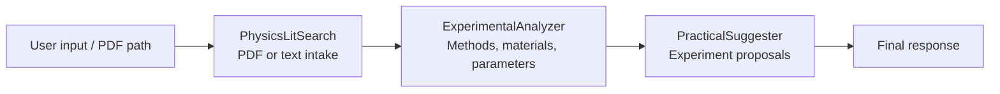
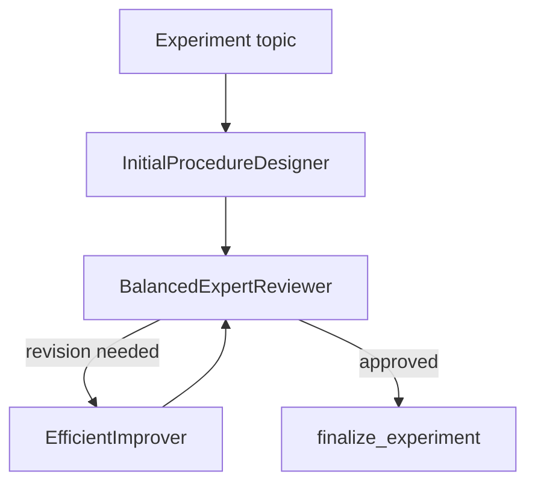

# Physics-Oriented Agent Workflows with Google ADK

Two physics-oriented workflows implemented with **Google Agent Development Kit (ADK)** are collected here: a one-way sequential pipeline and an iterative review-and-revision loop.

## Project Structure

```text
physics-agent-workflows/
├── README.md
├── sequential-literature-experiment-agent/
│   ├── requirements.txt
│   └── physics_experiment_agent/
│       ├── .env.example
│       ├── __init__.py
│       ├── agent.py
│       ├── config.py
│       ├── tools/
│       │   └── pdf_tools.py
│       └── sub_agents/
│           ├── physics_lit_search/
│           ├── experimental_analyzer/
│           └── practical_suggester/
└── iterative-experiment-review-agent/
    ├── requirements.txt
    └── physicsloop_tool_agent_2/
        ├── .env.example
        ├── __init__.py
        └── agent.py
```

# Workflow 1 — Sequential PDF/Text-to-Experiment Pipeline

The sequential workflow uses an ADK `SequentialAgent` to pass information through three specialized stages.



## Components

### `PhysicsLitSearch`

- accepts a local PDF path or text request;
- uses `read_pdf()` for PDF input;
- reads at most the first five PDF pages;
- produces structured information for the next stage.

The current implementation does **not** perform live web literature search.

### `ExperimentalAnalyzer`

Transforms the upstream information into a structured experimental report containing:

- literature / physics summary;
- experimental methods;
- research materials and instruments;
- key numerical parameters.

### `PracticalSuggester`

Uses the analysis report to generate two experiment proposals.

### Contribution Scope

This workflow was developed collaboratively by a four-person team. My primary responsibility was the **`PracticalSuggester`** component, including the logic that turns the upstream experimental analysis into concrete experiment proposals.

The broader coordination / information aggregation and user-facing output, literature-search component, and experimental-parameter analysis were primarily handled by the other three team members.

## Usage — Sequential Workflow

Enter the sequential project directory:

```bash
cd 03-rag-and-adk/adk/physics-agent-workflows/sequential-literature-experiment-agent
python -m venv .venv
```

Activate the environment.

**Windows PowerShell**

```powershell
.\.venv\Scripts\Activate.ps1
```

**macOS / Linux**

```bash
source .venv/bin/activate
```

Install dependencies:

```bash
pip install -r requirements.txt
```

Create the local environment file:

**Windows PowerShell**

```powershell
Copy-Item physics_experiment_agent/.env.example physics_experiment_agent/.env
```

**macOS / Linux**

```bash
cp physics_experiment_agent/.env.example physics_experiment_agent/.env
```

Replace the API-key placeholder in `physics_experiment_agent/.env`.

Run with the ADK Web UI:

```bash
adk web
```

Then select `physics_experiment_agent`.

Or run from the terminal:

```bash
adk run physics_experiment_agent
```

Example text request:

```text
Design two simple experiments for measuring the acceleration due to gravity and explain the important parameters.
```

For local PDF input, place a PDF in a local `papers/` directory and provide its path in the query, for example:

```text
Read papers/example.pdf, analyze the experimental method, and suggest two related experiments.
```

---

# Workflow 2 — Iterative Experiment Review and Improvement

The second workflow combines a `SequentialAgent` with an inner `LoopAgent`.



## Components

### `InitialProcedureDesigner`

Generates an initial experiment procedure containing purpose, equipment, steps, data recording, and analysis method.

### `BalancedExpertReviewer`

Checks the current procedure for consistency with the requested topic, operability, equipment choice, and analysis method.

### `EfficientImprover`

Revises the procedure according to reviewer feedback.

### `finalize_experiment()`

Signals completion when the reviewer accepts the current procedure.

The loop is limited to four iterations to prevent indefinite revision.

## Usage — Iterative Workflow

Enter the iterative project directory:

```bash
cd 03-rag-and-adk/adk/physics-agent-workflows/iterative-experiment-review-agent
python -m venv .venv
```

Activate the environment, install dependencies, and create the local environment file.

**Windows PowerShell**

```powershell
.\.venv\Scripts\Activate.ps1
pip install -r requirements.txt
Copy-Item physicsloop_tool_agent_2/.env.example physicsloop_tool_agent_2/.env
```

**macOS / Linux**

```bash
source .venv/bin/activate
pip install -r requirements.txt
cp physicsloop_tool_agent_2/.env.example physicsloop_tool_agent_2/.env
```

Replace the API-key placeholder in `physicsloop_tool_agent_2/.env`.

Run the ADK Web UI:

```bash
adk web
```

Then select `physicsloop_tool_agent_2` and enter an experiment topic directly in the chat, for example:

```text
Design an undergraduate experiment to measure the wavelength of a He-Ne laser using a diffraction grating.
```

## Sequential vs. Loop Orchestration

| Aspect | Sequential workflow | Iterative workflow |
|---|---|---|
| Main operation | Transform information through fixed stages | Repeatedly review and revise one procedure |
| Flow | One-way | Cyclic |
| Main state | Extracted information → analysis → suggestions | Current procedure + reviewer feedback |
| Stop condition | End of the pipeline | Approval signal or iteration limit |

## Limitations

- Outputs are generated by an LLM and should not be treated as experimentally validated procedures without expert review.
- The sequential workflow reads only the first five pages of a PDF through `read_pdf()`.
- The sequential workflow currently has no live literature-search API.
- The iterative workflow may stop because of the maximum iteration count even if the procedure has not been explicitly approved.

## Attribution and License

These physics-oriented workflows are collaborative work built with Google ADK. Contribution scope is described in the repository-level [`CONTRIBUTIONS.md`](../../../CONTRIBUTIONS.md).

Google ADK source and licensing information are listed in [`THIRD_PARTY_NOTICES.md`](../../../THIRD_PARTY_NOTICES.md).

Unless otherwise stated, these files are covered by the repository's Apache License 2.0.
